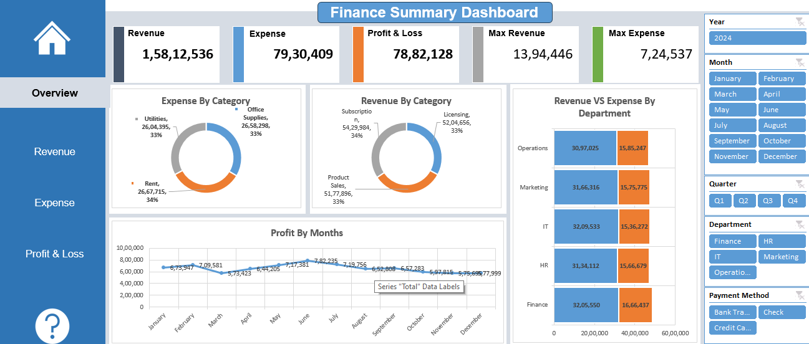

# 📊 Finance Performance Dashboard – Excel

## Project Overview
This project presents an interactive Finance Performance Dashboard built in Microsoft Excel to analyze revenue, expenses, and profitability across departments and time periods. The objective was to transform raw transactional financial data into a structured, insight-driven reporting system that supports performance monitoring and data-driven decision-making.

The dashboard provides a consolidated executive view of financial metrics, enabling comparative analysis and trend evaluation.

---

##  Project Objectives
- Structure unorganized financial data into analyzable formats
- Develop key performance indicators (KPIs) for financial evaluation
- Enable department-level revenue vs expense comparison
- Track monthly profit trends to assess performance stability
- Support decision-making through visual analytics

---

## 📈 Key Features & Components

### 1️⃣ KPI Summary Cards
- Total Revenue
- Total Expense
- Profit & Loss
- Maximum Revenue
- Maximum Expense

These indicators provide a high-level financial snapshot for quick evaluation.

### 2️⃣ Department-Level Comparison
- Revenue vs Expense comparison across departments
- Helps identify high-performing and high-cost areas

### 3️⃣ Category-wise Analysis
- Revenue distribution by category
- Expense distribution by category
- Enables identification of cost-heavy segments

### 4️⃣ Trend Analysis
- Monthly profit trend visualization
- Identifies fluctuations and seasonality patterns

### 5️⃣ Interactive Filters
- Year
- Month
- Quarter
- Department
- Payment Method

These filters allow dynamic data exploration and targeted financial analysis.

---

## 🛠 Tools & Techniques Used
- Microsoft Excel
- Pivot Tables for aggregation
- Data Structuring & Categorization
- KPI Calculation (Revenue, Expense, Profit)
- Dynamic Charts & Visualizations
- Interactive Filtering (Slicers)

---

## 💡 Key Insights Derived
- Identified departments where expenses were disproportionately high compared to revenue.
- Observed monthly fluctuations in profit indicating periods of higher operational efficiency.
- Analyzed category-wise cost distribution to understand major expense drivers.
- Enabled structured comparison to support performance evaluation and strategic review.

---

## 📊 Business Impact
This dashboard demonstrates how structured financial data can be transformed into an executive-level reporting tool. It supports:
- Performance monitoring
- Cost control evaluation
- Department efficiency assessment
- Data-driven financial decision-making

---

## 📷 Dashboard Preview

